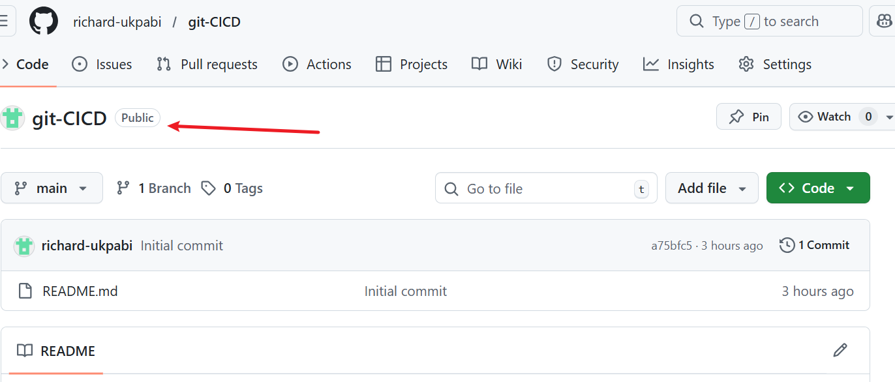
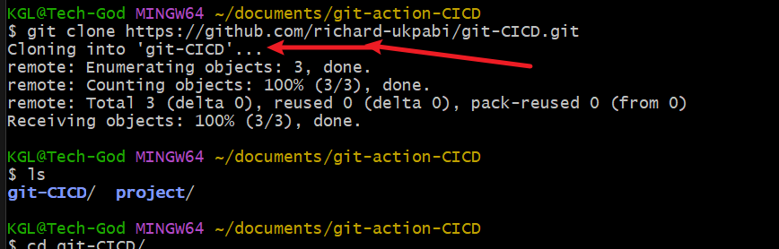

# git-action-plus
 Introduction to Continuous Integration and Continuous Delivery/Deployment

This aim of this course is to help understand the meaning of CICD and how it helps to make the life of a DevOps engineer and indeed anybody who wishes to automate code collaboration, integration and deployment and or delivery.

To start, there are a few prerequisite required in this course. They are as follows

1. ### Basic Knowledge of Git and GitHub,
- Understanding of version control concepts.
- Familiarity with basic Git operations like clone, commit, push, and pull.
- A GitHub account and knowledge of repository management on GitHub.

2. ### Understanding of Basic Programming Concepts:
- Fundamental programming knowledge, preferably in JavaScript, as the example project uses Node.js.
- Basic understanding of how web applications work.

3. ### Familiarity with Node.js and npm:
- Basic knowledge of Node.js and npm (Node Package Manager).
- Ability to set up a simple Node.js project and install dependencies using npm.

4. ### Text Editor or IDE:
- A text editor or Integrated Development Environment (IDE) like Visual Studio Code, Atom, Sublime Text, or any preferred editor for writing and editing code.

5. ### Local Development Environment:
- Node.js and npm installed on the local machine.
- Access to the command line or terminal.

6. ### Internet Connection:
- Stable internet connection to access GitHub and potentially other online resources or documentation.

7. ### Basic Understanding of CI/CD Concepts (Optional but Helpful):

## Lesson 1: Understanding Continuous Integration and Continuous Deployment

#### Objectives:

Define CI/CD and understand its benefits.
Get familiar with the CI/CD pipeline

1. Definition and Benefits of CI/CD:

Continuous Integration (CI) is the practice of merging all developers' working copies to a shared mainline several times a day.
Continuous Deployment (CD) is the process of releasing software changes to production automatically and reliably.

2. Overview of the CI/CD Pipeline

CI Pipeline typically includes steps like version control, code integration, automated testing, and building the application.
CD Pipeline involves steps like deploying the application to a staging or production environment, and post-deployment monitoring.
Tools: Version control systems (e.g., Git), CI/CD platforms (e.g., GitHub Actions), testing frameworks, and deployment tools.

Introduction to Continuous Integration and Continuous Deployment
The project will involve setting up a simple web application (e.g., a Node.js application) and applying CI/CD practices using GitHub Actions. This application will have basic functionality, such as serving a static web page.

Introduction to GitHub Actions and CI/CD Course Project
Welcome to our course on GitHub Actions and Continuous Integration/Continuous Deployment (CI/CD). This course is designed to provide a hands-on learning experience, guiding you through the essentials of automating software development processes using GitHub Actions. Whether you're a developer, a student, or just curious about CI/CD practices, this course will equip you with the practical skills and knowledge you need to implement these powerful automation techniques in your projects.

Why is This Relevant for Learners?
CICD Explanation

Imagine you're a chef in a busy restaurant. Every dish you prepare is like a piece of software code. Without a systematic approach, you might end up with orders being mixed up, dishes taking too long to prepare, or worse, the quality of the food being inconsistent. This is where a well-organized kitchen, with clear processes and automation (like having appliances that precisely time and cook parts of the dishes), comes into play. In software development, CI/CD is akin to this efficient kitchen. It ensures that your 'dishes' (software builds) are consistently 'cooked' (built, tested, and deployed) with precision and efficiency. By learning GitHub Actions and CI/CD, you're essentially learning how to set up and manage your high-tech kitchen in the software world, allowing you to serve 'dishes' faster, with higher quality, and with fewer 'kitchen mishaps' (bugs and deployment issues).

This course will help you understand and implement these practices, making your software development process more efficient and error-free, much like a well-orchestrated kitchen. Whether you're working on personal projects, contributing to open source, or building enterprise-level applications, mastering CI/CD with GitHub Actions will be an invaluable skill in your development toolkit.

Pre-requisites
Basic Knowledge of Git and GitHub:

Understanding of version control concepts.
Familiarity with basic Git operations like clone, commit, push, and pull.
A GitHub account and knowledge of repository management on GitHub.
Understanding of Basic Programming Concepts:

Fundamental programming knowledge, preferably in JavaScript, as the example project uses Node.js.
Basic understanding of how web applications work.
Familiarity with Node.js and npm:

Basic knowledge of Node.js and npm (Node Package Manager).
Ability to set up a simple Node.js project and install dependencies using npm.
Text Editor or IDE:

A text editor or Integrated Development Environment (IDE) like Visual Studio Code, Atom, Sublime Text, or any preferred editor for writing and editing code.
Local Development Environment:

Node.js and npm installed on the local machine.
Access to the command line or terminal.
Internet Connection:

Stable internet connection to access GitHub and potentially other online resources or documentation.
Basic Understanding of CI/CD Concepts (Optional but Helpful):

General awareness of Continuous Integration and Continuous Deployment concepts.
This can be part of the learning in the course, but prior knowledge is beneficial.
## Lesson 1: Understanding Continuous Integration and Continuous Deployment
Objectives:

Define CI/CD and understand its benefits.
Get familiar with the CI/CD pipeline.
Lesson Details:
Definition and Benefits of CI/CD:

Continuous Integration (CI) is the practice of merging all developers' working copies to a shared mainline several times a day.
Continuous Deployment (CD) is the process of releasing software changes to production automatically and reliably.
Benefits: Faster release rate, improved developer productivity, better code quality, and enhanced customer satisfaction.
Overview of the CI/CD Pipeline:

CI Pipeline typically includes steps like version control, code integration, automated testing, and building the application.
CD Pipeline involves steps like deploying the application to a staging or production environment, and post-deployment monitoring.
Tools: Version control systems (e.g., Git), CI/CD platforms (e.g., GitHub Actions), testing frameworks, and deployment tools.

## Lesson 2: Introduction to GitHub Actions
Objectives:
Understand what GitHub Actions is.
Learn key concepts and terminology.

- GitHub Actions: A CI/CD platform integrated into GitHub, automating the build, test, and deployment pipelines of your software directly within your GitHub repository.

Key Concepts and Terminology include:

Workflow: 
- Definition: A configurable automated process made up of one or more jobs. Workflows are defined by a YAML file in your repository.

Event: 
- Definition: A set of steps in a workflow that are executed on the same runner. Jobs can run sequentially or in parallel.

Step: 
- Definition: An individual task that can run commands within a job. Steps can run scripts or actions.

Action:

- Definition: Standalone commands combined into steps to create a job. Actions can be written by you or provided by the GitHub community.

Runner:

- Definition: A server that runs your workflows when they're triggered. Runners can be hosted by GitHub or self-hosted.

Introduction to Continuous Integration and Continuous Deployment
The project will involve setting up a simple web application (e.g., a Node.js application) and applying CI/CD practices using GitHub Actions. This application will have basic functionality, such as serving a static web page.

Introduction to GitHub Actions and CI/CD Course Project
Welcome to our course on GitHub Actions and Continuous Integration/Continuous Deployment (CI/CD). This course is designed to provide a hands-on learning experience, guiding you through the essentials of automating software development processes using GitHub Actions. Whether you're a developer, a student, or just curious about CI/CD practices, this course will equip you with the practical skills and knowledge you need to implement these powerful automation techniques in your projects.

Why is This Relevant for Learners?
CICD Explanation

Imagine you're a chef in a busy restaurant. Every dish you prepare is like a piece of software code. Without a systematic approach, you might end up with orders being mixed up, dishes taking too long to prepare, or worse, the quality of the food being inconsistent. This is where a well-organized kitchen, with clear processes and automation (like having appliances that precisely time and cook parts of the dishes), comes into play. In software development, CI/CD is akin to this efficient kitchen. It ensures that your 'dishes' (software builds) are consistently 'cooked' (built, tested, and deployed) with precision and efficiency. By learning GitHub Actions and CI/CD, you're essentially learning how to set up and manage your high-tech kitchen in the software world, allowing you to serve 'dishes' faster, with higher quality, and with fewer 'kitchen mishaps' (bugs and deployment issues).

This course will help you understand and implement these practices, making your software development process more efficient and error-free, much like a well-orchestrated kitchen. Whether you're working on personal projects, contributing to open source, or building enterprise-level applications, mastering CI/CD with GitHub Actions will be an invaluable skill in your development toolkit.

Pre-requisites
Basic Knowledge of Git and GitHub:

Understanding of version control concepts.
Familiarity with basic Git operations like clone, commit, push, and pull.
A GitHub account and knowledge of repository management on GitHub.
Understanding of Basic Programming Concepts:

Fundamental programming knowledge, preferably in JavaScript, as the example project uses Node.js.
Basic understanding of how web applications work.
Familiarity with Node.js and npm:

Basic knowledge of Node.js and npm (Node Package Manager).
Ability to set up a simple Node.js project and install dependencies using npm.
Text Editor or IDE:

A text editor or Integrated Development Environment (IDE) like Visual Studio Code, Atom, Sublime Text, or any preferred editor for writing and editing code.
Local Development Environment:

Node.js and npm installed on the local machine.
Access to the command line or terminal.
Internet Connection:

Stable internet connection to access GitHub and potentially other online resources or documentation.
Basic Understanding of CI/CD Concepts (Optional but Helpful):

General awareness of Continuous Integration and Continuous Deployment concepts.
This can be part of the learning in the course, but prior knowledge is beneficial.
Lesson 1: Understanding Continuous Integration and Continuous Deployment
Objectives:
Define CI/CD and understand its benefits.
Get familiar with the CI/CD pipeline.
Lesson Details:
Definition and Benefits of CI/CD:

Continuous Integration (CI) is the practice of merging all developers' working copies to a shared mainline several times a day.
Continuous Deployment (CD) is the process of releasing software changes to production automatically and reliably.
Benefits: Faster release rate, improved developer productivity, better code quality, and enhanced customer satisfaction.
Overview of the CI/CD Pipeline:

CI Pipeline typically includes steps like version control, code integration, automated testing, and building the application.
CD Pipeline involves steps like deploying the application to a staging or production environment, and post-deployment monitoring.
Tools: Version control systems (e.g., Git), CI/CD platforms (e.g., GitHub Actions), testing frameworks, and deployment tools.
Lesson 2: Introduction to GitHub Actions
Objectives:
Understand what GitHub Actions is.
Learn key concepts and terminology.
Lesson Details:
GitHub Actions: A CI/CD platform integrated into GitHub, automating the build, test, and deployment pipelines of your software directly within your GitHub repository.
Documentation Reference: Explore the GitHub Actions Documentation for in-depth understanding.
Key Concepts and Terminology:
Workflow:

Definition: A configurable automated process made up of one or more jobs. Workflows are defined by a YAML file in your repository.
Example: A workflow to test and deploy a Node.js application upon a Git push.
Documentation: Learn more about workflows in the GitHub Docs on Workflows.
Event:

Definition: A specific activity that triggers a workflow. Events include activities like push, pull request, issue creation, or even a scheduled time.
Example: A push event triggers a workflow that runs tests every time code is pushed to any branch in a repository.
Documentation: Review different types of events in the Events that trigger workflows section.
Job:

Definition: A set of steps in a workflow that are executed on the same runner. Jobs can run sequentially or in parallel.
Example: A job that runs tests on your application.
Documentation: Understand jobs in detail in the GitHub Docs on Jobs.
Step:

Definition: An individual task that can run commands within a job. Steps can run scripts or actions.
Example: A step in a job to install dependencies (npm install).
Documentation: Learn about steps in the Steps section of GitHub Docs.
Action:

Definition: Standalone commands combined into steps to create a job. Actions can be written by you or provided by the GitHub community.
Example: Using actions/checkout to check out your repository code.
Documentation: Explore GitHub Actions in the Marketplace and learn how to create your own in the Creating actions guide.
Runner:

Definition: A server that runs your workflows when they're triggered. Runners can be hosted by GitHub or self-hosted.
Example: A GitHub-hosted runner that uses Ubuntu.
Documentation: Delve into runners in the GitHub Docs on Runners.
Additional Resources:
GitHub Learning Lab: Interactive courses to learn GitHub Actions. Visit GitHub Learning Lab.
GitHub Actions Quickstart: For a hands-on introduction, check out the Quickstart for GitHub Actions.
Community Forums: Engage with the GitHub community for questions and discussions at GitHub Community Forums.

## Practical Implementation
Setting Up the Project:
Initialize a GitHub Repository:

Create a new repository on GitHub.
Clone it to your local machine

Create a Simple Node.js Application:

To create a node.js project, we will need to create a project folder, thereafter create a public folder and an index.js file in the folder. we also need to create a server.js file in the project folder. let's first initialize the node.js by running npm init and npm 
- Initialize a Node.js project (npm init)

- Create a simple server using Express.js to serve a static web page. This creates a package.json file as seen below

- We then run `npm install express` to provison the static web server

- Now update the server.js with the static code.

- Add your code to the repository and push it to GitHub.

3. cat Writing Your First GitHub Action Workflow:

Create a .github/workflows directory in your repository.
Add a workflow file (e.g., node.js.yml).

testing the simple node.js project with a git action workflow

